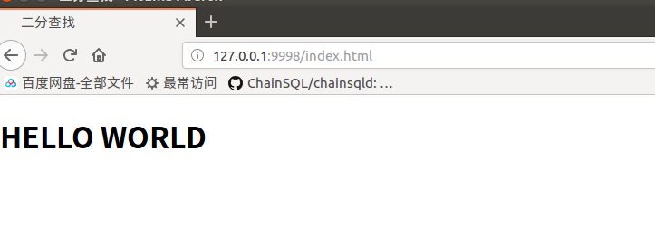
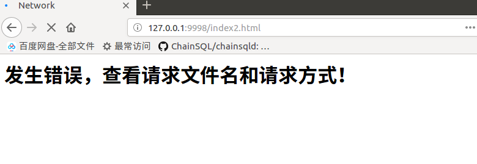

# 一个简易的HTTPServer

浏览器地址输入`http://127.0.0.1:9998/index.html`

则显示如下：

如果输入错误的地址：`http://127.0.0.1:9998/index2.html`

则显示如下：

以上代码在火狐和edge上均没有问题，但是在chorme浏览器上有问题，页面无法加载，甚至会直接把server端给宕掉。

目前尚未找到原因，之后有时间会去找的。