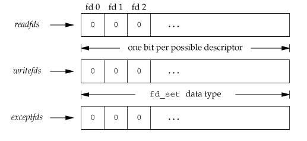
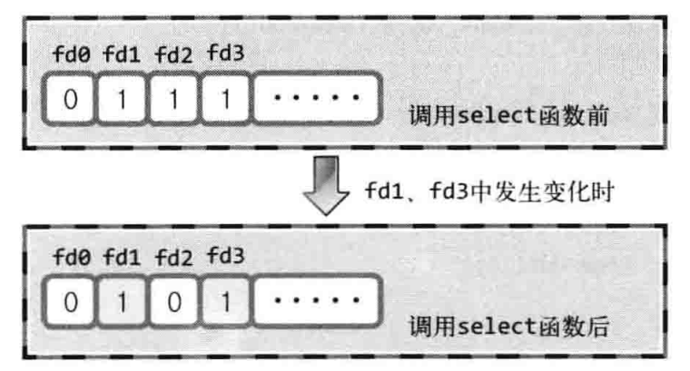

#  Basic Knowledge

## 1. 关于fork

```C++
#include <iostream>
#include <unistd.h>
using namespace std;
int val = 10;
int main(int argc, char *argv[])
{
    pid_t pid;
    int lval = 20;

    pid = fork();

    if(pid == 0){
        val += 2;
        lval += 5;
    }else{
        val -= 2;
        lval += 5;
    }

    if(pid == 0){
        cout << "val:" << val << ", lval = " << lval << endl;
    }else{
        cout << "val:" << val << ", lval = " << lval << endl;
    }
    return 0;
}
```

对于父进程而言，fork()函数返回子进程的ID（子进程的PID）；而对于子进程而言，fork函数返回0。

**僵尸进程**

父进程创建子进程后，子进程运行终止时刻（例如，调用`exit()`函数，或者运行到`main`中的`return`语句时，都会将返回的值传递给 操作系统），此时如果父进程还在运行，子进程并不会立即被销毁，直到这些值传到了产生该子进程的父进程。也就是说，如果父进程没有主动要求获得子进程的结束状态值，操作系统就会一直保存该进程的相关信息，并让子进程长时间处于僵尸状态，例如下面程序：

```C++
int main(){
    pid_t pid = fork();
    if(pid == 0){
        cout << "I am a Child Process." <<endl;
    }else{
        cout << "I am a Father Process and Child Process is " << pid << endl;
        sleep(30);  //让父进程休眠30秒，此时便于观察子进程的状态
    }
    if(pid == 0){
        cout << " Child Process exits " << endl;
    }else{
        cout << "Father Process exits " << endl;
    }
    return 0;
}
```

此时，运行该程序，查看后台进程可知：

```shell
gqx@gqx-Lenovo-Product:~$ ps -au
USER       PID %CPU %MEM    VSZ   RSS TTY      STAT START   TIME COMMAND
root       923  0.6  0.9 480840 159824 tty7    Ssl+ 4月09  36:07 /usr/lib/xorg/
root      1351  0.0  0.0  17676  1768 tty1     Ss+  4月09   0:00 /sbin/agetty -
...
gqx      24856  0.0  0.0      0     0 pts/11   Z+   11:03   0:00 [tes16] <defunct>
gqx      24859  0.0  0.0  39104  3300 pts/3    R+   11:03   0:00 ps -au
```

**僵尸进程的消除**

方法一：调用`wait()`函数：

```C++
/* Wait for a child to die.  When one does, put its status in *STAT_LOC
   and return its process ID.  For errors, return (pid_t) -1.

   This function is a cancellation point and therefore not marked with
   __THROW.  */
extern __pid_t wait (__WAIT_STATUS __stat_loc);
```

成功返回终止的进程ID，失败返回-1；子进程的最终返回值将指向该函数参数所指向的内存空间，但函数所指向的内存单元总还含有其他的信息，需要使用宏进行分离。

```C++
# define WIFEXITED(status)	__WIFEXITED (__WAIT_INT (status))  //子进程正常终止返回"true"
# define WEXITSTATUS(status)	__WEXITSTATUS (__WAIT_INT (status)) //返回子进程的返回值
```

要注意的是：**如果没有已终止的子进程，那么程序将被阻塞，直到有子进程终止。**

方法二：调用`waitpid()`函数

```C++
/* Wait for a child matching PID to die.
   If PID is greater than 0, match any process whose process ID is PID.
   If PID is (pid_t) -1, match any process.
   If PID is (pid_t) 0, match any process with the
   same process group as the current process.
   If PID is less than -1, match any process whose
   process group is the absolute value of PID.
   If the WNOHANG bit is set in OPTIONS, and that child
   is not already dead, return (pid_t) 0.  If successful,
   return PID and store the dead child's status in STAT_LOC.
   Return (pid_t) -1 for errors.  If the WUNTRACED bit is
   set in OPTIONS, return status for stopped children; otherwise don't.

   This function is a cancellation point and therefore not marked with
   __THROW.  */
extern __pid_t waitpid (__pid_t __pid, int *__stat_loc, int __options);
```

第一个参数：如果`__pid`的值是-1，则与`wait()`函数相同，可以等待任意的子程序终止；如果是0，则等待进程组识别码与目前进程相同的任何子进程；如果pid>0，则等待任何子进程识别码为 pid 的子进程。

第二个参数：与前一个函数`wait()`的参数意义相同。

第三个参数：常用WNOHANG——若pid指定的子进程没有结束，则waitpid()函数返回0，不予以等待。若结束，则返回该子进程的ID。

示例程序如下：

```C++
#include <iostream>
#include <stdlib.h>
#include <unistd.h>
#include <signal.h>
#include <sys/wait.h>
using namespace std;

void read_childproc(int sig){
    int status;
    pid_t id = waitpid(-1, &status, WNOHANG);
    if(WIFEXITED(status)){
        printf("Remove proc id: %d \n", id);
        printf("Child send: %d \n", WEXITSTATUS(status));
    }
}

int main(){
    pid_t pid;
    struct sigaction act;
    act.sa_handler = read_childproc;
    sigemptyset(&act.sa_mask);
    act.sa_flags = 0;
    sigaction(SIGCHLD, &act, 0);

    pid = fork();

    if(pid == 0){
        puts("Hi, I am a child process!");
        sleep(6);
        return 12;
    }else{
        printf("Child proc id: %d \n", pid);
        pid = fork();
        if(pid == 0){
            puts("Hi, I am a child process!");
            sleep(13);
            exit(24);
        }else{
            int i;
            printf("Child proc id: %d \n", pid);
            for(i  = 0; i < 4; i++){
                puts("wait...");
                sleep(5);
            }
        }
    }
    return 0;
}
```

## 2. 信号处理 

#### 理解概念

​	可以用来处理进程间的异步事件——即进程间可以通过系统调用来发送信号，只是告知某进程发生了什么事，使得被告知的进程去做对应的事件（信号处理），要注意的是，发送信号的过程并不会传送任何数据。通过`kill -l`可以看到信号的名字和序号。

可以通过这个案例来说明：

​	在终端运行`top`来查看系统运行的一些相关信息，可以看到终端的数据一直是变化的，同事通过`ps -aux|grep top`来查看现在系统是否正在运行该指令，可以得到运行该指令的进程号，然后用`kill -9 进程号`将该进程杀掉，我们此时通过`ps -aux|grep top`来发现此时`top`的运行相关信息已经没有了。这个过程就是一个进程给另一个进程发送了` SIGKILL`的信号。（注意：`kill`，就是送出一个特定的信号给某个进程，而该进程根据信号做出相应的动作（`sigqueue`也是），`-9`可以通过`kill -l` 看出是`SIGKILL`）

```shell
gqx@gqx-Lenovo-Product:~$ kill -l
 1) SIGHUP	 2) SIGINT	 3) SIGQUIT	 4) SIGILL	 5) SIGTRAP
 6) SIGABRT	 7) SIGBUS	 8) SIGFPE	 9) SIGKILL	10) SIGUSR1
 ......
```

#### 信号处理方式

一般信号的处理可以分为三种：

* 忽略信号  

  ​	大多数信号可以使用这个方式来处理，但是有两种信号不能被忽略（分别是 `SIGKILL`和`SIGSTOP`）。因为他们向内核和超级用户提供了进程终止和停止的可靠方法，如果忽略了，那么这个进程就变成了没人能管理的的进程，显然是内核设计者不希望看到的场景

  * 捕捉信号

    ​	需要告诉内核，用户希望如何处理某一种信号，说白了就是写一个信号处理函数，然后将这个函数告诉内核。当该信号产生时，由内核来调用用户自定义的函数，以此来实现某种信号的处理。

  * 系统的默认动作

    ​	对于每个信号来说，系统都对应由默认的处理动作，当发生了该信号，系统会自动执行。不过，对系统来说，大部分的处理方式都比较粗暴，就是直接杀死该进程。

处理方式转载自**[Linux 信号（signal）](https://www.jianshu.com/p/f445bfeea40a)**

#### 信号处理的注册函数

**1. signal函数**

```C++
/* Type of a signal handler.  */
typedef void (*__sighandler_t) (int);
/* Set the handler for the signal SIG to HANDLER, returning the old
   handler, or SIG_ERR on error.
   By default `signal' has the BSD semantic.  */
extern __sighandler_t signal (int __sig, __sighandler_t __handler);
```

第一个参数表示信号量类型（对应的`kill -l`里的数据），第二个参数则表示该进程被告知该信号后的处理函数。参考案例如下：

```C++
#include <iostream>
#include <list>
#include <unistd.h>
#include <sys/wait.h>
using namespace std;
void timeout(int sig){
    if(sig == SIGALRM){
        puts("Time out!");
    }
    alarm(2);
}

void keycontrol(int sig){
    if(sig == SIGINT){
        puts("CTRL + C pressed");
    }
}

int main(){
    int  i;
    signal(SIGALRM, timeout);   //到达通过了alarm函数设置的时间，调用函数timeout
    signal(SIGINT, keycontrol); //键盘键入Ctrl+后，调用keycontrol函数
    alarm(2);

    for(i = 0; i < 6; i++){
        puts("wait...");
        sleep(100);
    }
    return 0;
}
```

​	这段代码要注意的是，在`signal`中注册信号函数后，调用信号函数的则是**操作系统**，但进程处于睡眠状态的时间为100s，而alarm函数等待的时间是2秒，即2秒后会产生`SIGALRM`信号，此时将唤醒处于休眠状态的进程，而且进程一旦被唤醒，则不会再进入休眠状态，所以上述程序运行时间比较短。

**2. sigaction**

该函数已经完全取代了上述`signal`函数。

```C++
struct sigaction {
   void       (*sa_handler)(int); //信号处理程序，不接受额外数据，SIG_IGN 为忽略，SIG_DFL 为默认动作
   void       (*sa_sigaction)(int, siginfo_t *, void *); //信号处理程序，能够接受额外数据和sigqueue配合使用
   sigset_t   sa_mask;//阻塞关键字的信号集，可以再调用捕捉函数之前，把信号添加到信号阻塞字，信号捕捉函数返回之前恢复为原先的值。
   int        sa_flags;//影响信号的行为SA_SIGINFO表示能够接受数据
 };
/* Get and/or set the action for signal SIG.  */
extern int sigaction (int __sig, const struct sigaction *__restrict __act,
		      struct sigaction *__restrict __oact) __THROW;
```

第一个参数表示信号量类型；第二个参数信号处理函数；第三个参数：通过此参数获取之前注册的信号处理函数指针，若不需要，则传递0；

程序示例如下，改程序用来消除由父进程产生的两个子进程会导致僵尸进程的产生的情况，当子进程的生命周期结束后，回收子进程的内存信息，而不用等到父进程结束才去回收销毁子进程：

```C++
#include <iostream>
#include <list>
#include <unistd.h>
#include <sys/wait.h>
using namespace std;
void read_childproc(int sig){
    int status;
    pid_t id = waitpid(-1, &status, WNOHANG);   //消灭子进程结束后产生的僵尸进程
    if(WIFEXITED(status)){
        printf("Remove proc id: %d \n", id);
        printf("Child send: %d \n", WEXITSTATUS(status));
    }
}

int main(){
    pid_t pid;
    struct sigaction act;
    act.sa_handler = read_childproc;
    sigemptyset(&act.sa_mask);  //将sa_mask所有位初始化为0（初始化sa_mask中传入的信号集，清空其中所有信号）
    act.sa_flags = 0;
    sigaction(SIGCHLD, &act, 0);    //SIGCHLD 子进程结束信号
    pid = fork();
    if(pid == 0){
        puts("Hi, I am a child process!");
        sleep(6);
        return 12;
    }else{
        printf("Child proc id: %d \n", pid);
        pid = fork();
        if(pid == 0){
            puts("Hi, I am a child process!");
            sleep(13);
            exit(24);
        }else{
            int i;
            printf("Child proc id: %d \n", pid);
            for(i  = 0; i < 4; i++){
                puts("wait...");
                sleep(5);
            }
        }
    }
    return 0;
}
```


## 3. 进程间通信

进程间通信（IPC，InterProcess Communication）是指在不同进程之间传播或交换信息。进程间通信的方式有如下几种：

### 1.管道通信

**特点：**

1. 管道只允许具有血缘关系的进程间通信，如父子进程间的通信。

2. 它是半双工的（即数据只能在一个方向上流动），具有固定的读端和写端。
3. 管道并非是进程所有的资源，而是和套接字一样，归操作系统所有。可以将它看成文件系统，但该文件系统只存在于内存当中。

**原型**

```C++
#include <unistd.h>
/* Create a one-way communication channel (pipe).
   If successful, two file descriptors are stored in PIPEDES;
   bytes written on PIPEDES[1] can be read from PIPEDES[0].
   Returns 0 if successful, -1 if not.  */
extern int pipe (int fd[2]) __THROW __wur;
```

参数的说明：

​	字符数组fd是管道传输或者接收时用到的文件描述符，其中`fd[0]`是接收的时候使用的文件描述符，即管道出口；而`fd[1]`是传输的时候用到的文件描述符，即管道入口。

​	为了使数据可以双向传递，可以使用两个管道，一个管道负责进程1的写和进程2的读，另一个管道负责一个进程1的读和进程2的写。测试程序如下：

```C++
#include <iostream>
#include <stdlib.h>
#include <unistd.h>
#include <sys/wait.h>
#define BUF_SIZE 30

int main(){
    int fds1[2], fds2[2];
    /*
     *注意：
     * 此处不能写char* str1 = "Who are you?";
     * 得到的sizeof(str1)等于8，该值实际上是指针的大小，并不是字符串数组的大小
     * 这个时候要用strlen()函数（strlen的唯一标准是找‘\0’）
     * 系统函数返回值是char *(#include <string.h>)类型的往往会在末尾加上'\0'。
     * 要注意的是未初始化的情况下，用strlen是不可行的
     **/
    char str1[] = "Who are you?";
    char str2[] = "Thank you for your message.";
    char buf[BUF_SIZE];
    pipe(fds1);     //创建两个管道
    pipe(fds2);

    pid_t pid = fork();
    if(pid == 0){
        write(fds1[1], str1, sizeof(str1));
        read(fds2[0], buf, BUF_SIZE);
        printf("Child process copy the message: %s\n", buf);
    }else {
        read(fds1[0], buf, BUF_SIZE);
        printf("Parent Process copy the message: %s\n", buf);
        write(fds2[1], str2, sizeof(str2));
    }
    return 0;
}
```


**2.FIFO**

​	FIFO即命名管道，**在磁盘上有对应的节点，但没有数据块**—换言之，只是拥有一个名字和相应的访问权限，通过`mknode()`系统调用或者`mkfifo()`函数来建立的。一旦建立，任何进程都可以通过文件名将其打开和进行读写，而不局限于父子进程，当然前提是进程对FIFO有适当的访问权。当不再被进程使用时，FIFO在内存中释放，但磁盘节点仍然存在。

```C++
/* Create a new FIFO named PATH, with permission bits MODE.  */
extern int mkfifo (const char *__path, __mode_t __mode)
     __THROW __nonnull ((1));
```

其中的 mode 参数与`open`函数中的 mode 相同。一旦创建了一个 FIFO，就可以用一般的文件I/O函数操作它。

当 open 一个FIFO时，是否设置非阻塞标志（`O_NONBLOCK`）的区别：

* 若没有指定`O_NONBLOCK`（默认），以只读方式打开的FIFO要阻塞到其他的某个程序以写打开这个FIFO。同样以只写方式打开的FIFO要阻塞到其他某个进程以读方式打开该FIFO。
* 若指定了`O_NONBLOCK`，则以只读方式打开会立刻返回而不阻塞（不是出错返回）。而以只写方式打开，若之前没有进程以读方式打开这个FIFO则立刻出错返回。

示例代码：一个进程发送消息给另一个进程

writefifo.cpp

```C++
#include <iostream>
#include <stdio.h>
#include <errno.h>
#include <stdlib.h>
#include <sys/stat.h>
#include <fcntl.h>  // O_WRONLY
#include <time.h>   //time
#include <unistd.h>
using namespace std;

int main(){
    int fd;
    int n;
    char buf[1024];
    time_t tp;

    if( mkfifo("fifo1",  0666) < 0 && errno != EEXIST) //创建FIFO管道
    {
        perror("Create FIFO Faileed");
    }

    printf("I am %d process.\n", getpt());  //说明进程的ID

    if((fd = open("fifo1",O_WRONLY )) < 0){   //以只写方式打开FIFO
        perror("Open FIFO failed");
        exit(1);
    }
    for (int i = 0; i < 10; ++i) {
        time(&tp);  //获取当前系统时间
        n = sprintf(buf, "Process %d's time is %s",getpid(), ctime(&tp));
        printf("send message: %s", buf);
        if(write(fd, buf, n+1) < 0)
        {
            perror("write FIFO Failed");
            close(fd);
            exit(1);
        }
        sleep(1);
    }
    close(fd);
    return 0;
}

```

readfifo.cpp

```C++
#include <stdio.h>
#include <iostream>
#include <stdlib.h>
#include <errno.h>
#include <sys/stat.h>
#include <fcntl.h>  // O_WRONLY
#include <time.h>   //time
#include <unistd.h>
using namespace std;

int main(){
    int fd;
    int len;
    char buf[1024];
    if((fd = open("fifo1",  O_RDONLY)) < 0){   //以只读方式打开FIFO
        perror("Open FIFO failed");
        exit(1);
    }
    while ((len = read(fd, buf ,1024)) > 0)   //读取FIFO管道
    {
       printf("Read message: %s", buf);
    }

    close(fd);
    return 0;
}

```

如果在`writefifo.cpp`中修改如下，设置非阻塞标志：

```C++
if((fd = open("fifo1",O_WRONLY | O_NONBLOCK)) < 0){   //以只写方式打开FIFO
```

如果先运行writefifo，在运行readfifo，则会出错。

**3. 消息队列**

​	消息队列，就是一个消息的链表，是一系列保存在**内核**的列表。用户进程可以向消息队列添加消息，也可以向消息队列读取消息。

特点：

* 队列独立于发送与接收进程。进程终止时，消息队列及其内容并不删除。
* 消息队列可以实现消息的随机查询,消息不一定要以先进先出的次序读取,也可以按消息的类型读取。

**4.共享内存**

​	共享内存（Shared Memory），指两个或多个进程共享一个给定的存储区。

**5. 信号量**

​	信号量是一个计数器，可以用来控制多个进程对共享资源的访问。它常作为一种锁机制，防止某进程正在访问共享资源时，其他进程也访问该资源。因此，主要作为进程间以及同一进程内不同线程之间的同步手段。

**6.套接字**

​	套解口也是一种进程间通信机制，与其他通信机制不同的是，它可用于不同及其间的进程通信。


## 4. I/O复用

​	内核（操作系统）一旦发现进程指定的一个或者多个IO条件准备读或者准备写的时候，就会给该进程发一个通知。当服务端要处理多个套接字文件描述符的时候，这个时候可以采用IO复用，操作系统发现哪些套接字文件描述符可读或可写的时候，就会通知相应的进程才去执行对应的read（保证文件描述符对应的地址有可用的数据返回，而不是由于试探性的返回无用的值）或write操作。

可以举个例子：

例如：现在李老师收取刚刚布置给学生要默写在纸上的古诗的作业。

第一种情况：李老师按照学号的顺序来收取，并且会等待将要收取作业的同学同意提交作业，直到该同学提交作业，才会去下一个学号的同学那里去询问是否提交作业。（循环处理每个socket，不支持高并发，效率低）

第二种情况：李老师向其他老师请求帮助，拉来了很多老师帮忙收作业，每个老师处理一小部分学生的古诗词作业的提交任务。（相当与创建多个进程或者线程处理socket）

第三种情况：李老师站在讲台上，根据同学们的反应来做出相应的动作（如果谁的要提交作业，该同学就举手），某些同学举手后，李就会去收取这些同学的作业。（IO复用）

### 系统调用函数实现IO复用

​	将多个文件描述符集中到一起统一监视。比如对多个套接字进行统一管理与调度 。

#### select函数

函数会做的事情包括：

* 检测是否存在套接字接受数据
* 检测是否存在套接字无阻塞的传输数据
* 哪些套接字发生了异常

该函数的调用时的顺序

1. 设置文件描述符

   将需要监视的文件描述符集中到一起(fd_set)，集中的时候要按照监视项来区分（包括接收，传输，异常）。`fd_set`结构体如下：

   ```C++
   
   /* The fd_set member is required to be an array of longs.  */
   typedef long int __fd_mask;
   /* Number of descriptors that can fit in an `fd_set'.  */
   #define __FD_SETSIZE		1024
   /* It's easier to assume 8-bit bytes than to get CHAR_BIT.  */
   #define __NFDBITS	(8 * (int) sizeof (__fd_mask))
   /* fd_set for select and pselect.  */
   typedef struct
     {
       __fd_mask fds_bits[__FD_SETSIZE / __NFDBITS];
     } fd_set;
   ```

   `fd_set`结构如下（有三种情况，监听接收作用的fd_set，监听传输作用的fd_set，监听异常作用的fd_set），当对应的区上的位置的值0被置为1，表示该位置对应的文件描述符正在被监视，或可读或可写，亦或者是有异常：

   

   在`fd_set`中注册文件描述符或者更改值的操作都是由相关宏来完成的。

   ```C++
   /* Access macros for `fd_set'.  */
   #define	FD_SET(fd, fdsetp)	__FD_SET (fd, fdsetp)  
   #define	FD_CLR(fd, fdsetp)	__FD_CLR (fd, fdsetp)  
   #define	FD_ISSET(fd, fdsetp)	__FD_ISSET (fd, fdsetp)
   #define	FD_ZERO(fdsetp)		__FD_ZERO (fdsetp)  
   
   FD_ZERO(fd_set* fdset);			  //将fd_set的所有位都初始化为0 
   FD_SET(int fd, fd_set* fdset);	  //在fd_set中注册文件描述符fd的信息
   FD_CLR(int fd, fd_set* fdset);    //从参数fd_set中清除文件描述符fd的信息
   FD_ISSET(int fd, fd_set* fdset);  //若参数fd_set所指向的变量包含文件描述符fd的信息，则返回1，否则返回0
   ```

2. 指定监视范围和超时

   `select`函数的原型如下：

   ```C++
   /* Check the first NFDS descriptors each in READFDS (if not NULL) for read
      readiness, in WRITEFDS (if not NULL) for write readiness, and in EXCEPTFDS
      (if not NULL) for exceptional conditions.  If TIMEOUT is not NULL, time out
      after waiting the interval specified therein.  Returns the number of ready
      descriptors, or -1 for errors.
   
      This function is a cancellation point and therefore not marked with
      __THROW.  */
   extern int select (int __nfds, fd_set *__restrict __readfds,
   		   fd_set *__restrict __writefds,
   		   fd_set *__restrict __exceptfds,
   		   struct timeval *__restrict __timeout);
   ```

   第一个参数：监视对象文件描述符的数量

   第二个参数：传递包含所有关注“是否存在待读取”的文件描述符的fdset。

   第三个参数：传递包含所有关注“是否可传输无阻塞数据”的文件描述符的fdset 。             

   第三个参数：传递包含所有关注“是否可发生异常”的文件描述符的fdset 。    

   第四个参数：为防止陷入无限阻塞的状态， 传递超时信息。                                                                                                                                                                                                                                                                              

3. 调用select函数

   调用函数返回结果： 

   * -1：发送错误时返回-1。
   * 0：超时返回0。
   * \>0：返回发生时间的文件描述符。

4. 调用select查看结果

   `select`函数返回值如果是大于0的整数，表示相应数量的文件描述符发生了变化。如下图示例，

   

   调用函数select函数时，向其传递的fd_set变量将发送变化，所有的1都被为0，但发生变化变化的文件描述符对应的位除外，如图，调用select函数结束后，可知传入的fd_set中只有fd1和fd3是1，即它们对应的文件描述符发生了变化。

**进一步理解select函数**

​	理解select模型的关键在于理解fd_set(这里声明的变量名为reads)这个数据结构，现在假设fd_set的大小是1字节，即8个bit（位）。执行过程可以这样表示：

* 第一步：FD_ZERO(&reads);   将read指向的fd_set初始化为00000000。
* 将对应位设置处于监听状态，如fd=6，FD_SET(fd, &reads);此时fd_set变为00100000。
* 如果还有需要监听的文件描述符，fd1=1，fd2=2，通过FD_SET后结果变为00100011。
* 调用select(7,reads,0,0,timeval)阻塞等待。默认是从位置0开始，所以要将最大的fd_max+1。
* 如果此时fd=2对应的文件描述服发生了可读事件，select调用结束，此时fd_set对应的值是00000010，没有事件发生所对应的位将被清空。

**示例程序**

​	利用select监听键盘输入操作：

```C++
#include <iostream>
#include <list>
#include <unistd.h>
#include <sys/wait.h>
#include <sys/select.h>
using namespace std;
#define BUF_SIZE 30

int main(){
    fd_set reads, temps;
    int result, str_len;
    char buf[BUF_SIZE];
    struct timeval timeout;

    FD_ZERO(&reads);
    FD_SET(0, &reads);  //0-该位置是控制台的标准输入

    while (1) {
        temps = reads;
        timeout.tv_sec = 5; //秒
        timeout.tv_usec = 0; //微秒
        result = select(1, &temps, 0, 0, &timeout);
        if(result == -1){
            puts("select() error...");
            break;
        }
        else if(result == 0){
            puts("Time wait...");
        }else{
            if(FD_ISSET(0, &temps)){    //fd_set指向的变量中包含文件描述符的信息，返回真
                str_len = read(0, buf, BUF_SIZE);
                buf[str_len] = 0;
                printf("message from console: %s.", buf);
            }
        }

    }

    return 0;
}

```
**select模型的特点**

* 可监控的文件描述符的数量与机器对应的fd_set大小有关，即sizeof(fd_set);
* 将fd_set传入到select函数调用前，还需要一个fd_set结构存储源数据，用于和调用select函数后的fd_set进行逐位对比，如果有事件发生，则通过FD_ISSET返回；如果原来标记为1，处于监听的文件描述符但没有事件发生，此时会将其置为0;。如上面示例程序的reads和temps。
* select上接收到普通数据或者带外数据会使select返回不同的就绪状态，普通数据触发可读状态，带外数据触发异常状态。

如下，是一个I/O复用的服务端的案例用来解决多客户端请求的问题：

```C++
#include <stdio.h>
#include <stdlib.h>
#include <string.h>
#include <unistd.h>
#include <signal.h>
#include <sys/wait.h>
#include <arpa/inet.h>
#include<sys/socket.h>

#define BUF_SIZE 100
void error_handling(char* message);

int main(int argc, char *argv[]){
    int serv_sock, clnt_sock;
    struct sockaddr_in serv_adr, clnt_adr;
    struct timeval timeout;
    fd_set reads, cpy_reads;

    socklen_t adr_sz;
    int fd_max, str_len, fd_num, i;
    char buf[BUF_SIZE];
    if(argc != 2){
        printf("Usage : %s <port>\n", argv[0]);
        exit(1);
    }

    serv_sock = socket(PF_INET, SOCK_STREAM, 0);
    memset(&serv_adr, 0, sizeof(serv_adr));
    serv_adr.sin_family = AF_INET;
    serv_adr.sin_port = htons(atoi(argv[1]));
    serv_adr.sin_addr.s_addr = htonl(INADDR_ANY);

    if(bind(serv_sock, (struct sockaddr*)&serv_adr, sizeof(serv_adr)) == -1){
        error_handling("bind() error.........");
    }

    if(listen(serv_sock, 5) == -1){
        error_handling("listen error.........");
    }

    FD_ZERO(&reads);
    FD_SET(serv_sock, &reads);
    fd_max = serv_sock;

    while(1){   //无限循环中调用select
        cpy_reads = reads;
        timeout.tv_sec = 5;
        timeout.tv_usec = 500;

        if((fd_num = select(fd_max+1, &cpy_reads, 0, 0, &timeout)) == -1)
            break;

        if(fd_num == 0)
            continue;

        for(i = 0; i < fd_max+1; i++){  //遍历观察那些文件描述符发生了变化
            if(FD_ISSET(i, &cpy_reads))  //观察fd_set中位发生变化
            {
                if(i == serv_sock){     //如果是连接请求
                    adr_sz = sizeof(clnt_adr);
                    clnt_sock = accept(serv_sock, (struct sockaddr*)&clnt_adr, &adr_sz);
                    FD_SET(clnt_sock, &reads);
                    if(fd_max < clnt_sock)  //如果clnt_sock对应fd_set中位置大于原先设定的需要监听的范围，则修改监听范围。
                        fd_max  = clnt_sock;
                    printf("Connected client : %d \n", clnt_sock);
                }
                else{   //某些套接字文件描述符指向的信息发生了改变，即收到通知，该文件描述符现在可读
                    str_len = read(i, buf, BUF_SIZE);
                    if(str_len == 0){
                        FD_CLR(i,&reads);
                        close(i);
                        printf("close client:%d \n", i);
                    }else{
                        write(i, buf, str_len);
                    }
                }
            }
        }
    }
    close(serv_sock);
    return 0;
}

void error_handling(char* message){
    fputs(message, stderr);
    fputc('\n', stderr);
    exit(1);
}
```

#### epoll

​	epoll是在2.5.44版内核中提出的（在使用前，应该验证一下内核版本，现在大部分内核版本都在2.6以上，可以通过`cat /proc/sys/kernel/osrelease`查看），而且epoll方式只在linux下体统支持。关于epoll实现的三个函数：

```C++
#include <sys/epoll.h>
int epoll_create(int size);	
int epoll_ctl(int epfd, int op, int fd, struct epoll_event *event);
int epoll_wait(int epfd, struct epoll_event * events, int maxevents, int timeout);
```

**epoll_create**  

```C++
int epoll_create(int size);	
```

通过调用该函数执行成功后创建的文件描述符保存空间被称为“epoll例程”，参数size只是为操作系统提供一个参考需要为epoll例程多大的空间，即size大小并不等于最终的epoll例程大小。

**epoll_ctl**

​	生成epoll例程后，在其内部注册监视对象文件描述符时需要用到`epoll_ctl`

```C++
int epoll_ctl(int epfd, int op, int fd, struct epoll_event *event);
```

参数说明：

* epfd     用于注册监视对象的epoll实例（文件描述符）
* op        指定监视对象的添加，删除或修改等操作
* fd         需要监视对象的文件描述符
* event   监视对象的事件类型

op可以有3个值，分别为：

- EPOLL_CTL_ADD : 添加监听的事件
- EPOLL_CTL_DEL : 删除监听的事件
- EPOLL_CTL_MOD : 修改监听的事件

如`epoll_ctl(A, EPOLL_CTL_ADD, B, C)`表示在epoll例程A中注册文件描述符B用于监视参数C中的事件。

epoll_event的结构体如下：

```C++
struct epoll_event {
    __uint32_t   events; /* Epoll events */
    epoll_data_t data;   /* User data variable 根据用户需求定制 */
};
typedef union epoll_data {
    void        *ptr;
    int          fd;
    __uint32_t   u32;
    __uint64_t   u64;
} epoll_data_t;
```

epoll_event的event中保存的常量及其对应的具体时间类型

- EPOLLERR : 文件上发上了一个错误。这个事件是一直监控的，即使没有明确指定
- EPOLLHUP : 文件被挂断。这个事件是一直监控的，即使没有明确指定
- EPOLLRDHUP : 对端关闭连接或者shutdown写入半连接
- EPOLLET : 开启边缘触发，默认的是水平触发，所以我们并未看到EPOLLLT
- EPOLLONESHOT : 一个事件发生并读取后，文件自动不再监控
- EPOLLIN : 文件可读
- EPOLLPRI : 文件有紧急数据可读
- EPOLLOUT : 文件可写
- EPOLLWAKEUP : 如果EPOLLONESHOT和EPOLLET清除了，并且进程拥有CAP_BLOCK_SUSPEND权限，那么这个标志能够保证事件在挂起或者处理的时候，系统不会挂起或休眠

如下示例代码展示其过程

```C++
struct epoll_event event;
event.events = EPOLLIN;	//发生需要读取数据的情况时
event.data.fd = sockfd;
epoll_ctl(epfd,EPOLL_CTL_ADD,sockfd,event);
```

如果`epoll_ctl`方法返回-1，则标志出现了问题，我们可以读取errno来定位错误，有如下errno会被设置：

- EBADF : epfd或者fd不是一个有效的文件描述符
- EEXIST : op为EPOLL_CTL_ADD，但fd已经被监控
- EINVAL : epfd是无效的epoll文件描述符
- ENOENT : op为EPOLL_CTL_MOD或者EPOLL_CTL_DEL，并且fd未被监控
- ENOMEM : 没有足够的内存完成当前操作
- ENOSPC : epoll实例超过了/proc/sys/fs/epoll/max_user_watches中限制的监听数量

**epoll_wait**

```C++
int epoll_wait(int epfd, struct epoll_event * events, int maxevents, int timeout);
```

参数说明：

* epfd              用于注册监视对象的epoll实例（文件描述符）
* events           保存发生事件的文件描述符集合的结构体地址值（数组首地址）
* maxevents    保存的最大事件数量
* timeout          等待时间（毫秒），-1表示一直等待事件的发生

该函数的作用类似与select函数。该函数被调用后，返回发生事件的文件描述符数，同时，第二个参数保存发生事件的文件描述符集合。此时，就不需要向像select那样针对所有文件描述符进行循环扫描，确定发生事件的文件描述符。

**工作模式**

epoll对文件描述符的操作有两种模式：LT（level trigger 条件触发）和ET（edge trigger 边缘触发）。LT模式是默认模式，LT模式与ET模式的区别可以通过TCP/IP网络编程书中的案例进行解释：

1. LT 水平触发

- 儿子：“妈妈，我收到了5000元压岁钱。”
- 妈妈：“恩，省着点花！”
- 儿子：“妈妈，我今天买了个ipad，花了3000元。”
- 妈妈：“噢，这东西真贵。”
- 儿子：“妈妈，我今天买好多吃的，还剩1000元。”
- 妈妈：“用完了这些钱，我可不会再给你了。”
- 儿子：“妈妈，那1000元我没花，零花钱够用了。”
- 妈妈：“恩，这才是明智的做法！”
- 儿子：“妈妈，那1000元我没花，我要攒起来。”
- 妈妈：“恩，加油！”

   只要儿子手中还有钱，他就会一直汇报，这就是LT模式。有钱就是1，没钱就是0，那么只要儿子还有钱，这种事件就是1->1类型事件，自然是LT。将案例中儿子钱包换成输入缓冲区，压岁钱换成输入数据，在条件触发中，只要输入缓冲区有数据，将将会以事件的方式再次注册。

2. ET 边缘触发

- 儿子：“妈妈，我收到了5000元压岁钱。”
- 妈妈：“恩，省着点花！”
- 儿子：“……”
- 妈妈：“你倒是说话啊？压岁钱呢？！”

 儿子从没钱到有钱，是一个0->1的过程，因此为ET。儿子和妈妈说过自己拿到了压岁钱就完事了，至于怎么花钱，还剩多少钱，一概不说。可以看出，边缘触发中输入缓冲区中收到数据时仅注册一次，即使输入缓冲区中还有数据，也不会再次注册。

**示例程序**

基于socket的客户端和服务端利用epoll来处理I/O复用问题：

服务端程序：

```C++
#include <stdio.h>
#include <stdlib.h>
#include <string.h>
#include <unistd.h>
#include <signal.h>
#include <sys/wait.h>
#include <arpa/inet.h>
#include<sys/socket.h>
#include<sys/epoll.h>
#define BUF_SIZE 4
#define EPOLL_SIZE 50
void error_handling(char* message);

int main(int argc, char *argv[]){
    int serv_sock, clnt_sock;
    struct sockaddr_in serv_adr, clnt_adr;


    socklen_t adr_sz;
    int  str_len, i;
    char buf[BUF_SIZE];
    if(argc != 2){
        printf("Usage : %s <port>\n", argv[0]);
        exit(1);
    }

    struct epoll_event* ep_events;
    struct epoll_event event;
    int epfd, event_cnt;

    serv_sock = socket(PF_INET, SOCK_STREAM, 0);
    memset(&serv_adr, 0, sizeof(serv_adr));
    serv_adr.sin_family = AF_INET;
    serv_adr.sin_port = htons(atoi(argv[1]));
    serv_adr.sin_addr.s_addr = htonl(INADDR_ANY);

    if(bind(serv_sock, (struct sockaddr*)&serv_adr, sizeof(serv_adr)) == -1){
        error_handling("bind() error.........");
    }

    if(listen(serv_sock, 5) == -1){
        error_handling("listen error.........");
    }

    epfd = epoll_create(EPOLL_SIZE); //返回创建的epoll文件描述符
    ep_events = (struct epoll_event*)malloc(sizeof(struct epoll_event)*EPOLL_SIZE);

    event.events = EPOLLIN; //发生读取事件的时候
    event.data.fd = serv_sock;
    epoll_ctl(epfd, EPOLL_CTL_ADD, serv_sock, &event);

    while(1){
        event_cnt = epoll_wait(epfd, ep_events, EPOLL_SIZE, -1);

        if(event_cnt == -1){
            error_handling("epoll_wait() failed...");
        }

        puts("return epoll_wait");
        for(i = 0; i < event_cnt; i++){
            if(ep_events[i].data.fd == serv_sock){  //处理新进的连接请求
                adr_sz = sizeof(clnt_adr);
                clnt_sock = accept(serv_sock, (struct sockaddr*)&clnt_adr, &adr_sz);
                event.data.fd = clnt_sock;
                event.events= EPOLLIN;
                epoll_ctl(epfd, EPOLL_CTL_ADD, clnt_sock, &event);
                printf("Connected client: %d \n", clnt_sock);
            }else{
                str_len = read(ep_events[i].data.fd, buf, BUF_SIZE);
                if(str_len == 0){   // 关闭客户端连接
                    epoll_ctl(epfd, EPOLL_CTL_DEL, ep_events[i].data.fd, NULL); //将读取完的连接取消监听
                    close(ep_events[i].data.fd);    //关闭客户端连接
                    printf("close client: %d \n", ep_events[i].data.fd);
                }else{
                    write(ep_events[i].data.fd, buf, str_len);
                }
            }
        }
    }
    close(serv_sock);
    close(epfd);
    return 0;
}

void error_handling(char* message){
    fputs(message, stderr);
    fputc('\n', stderr);
    exit(1);
}
```

客户端程序：

```C++
#include <stdio.h>
#include <stdlib.h>
#include <string.h>
#include <sys/socket.h>
#include <arpa/inet.h>
#include <unistd.h>
using namespace std;

#define BUF_SIZE 1024
void errorhandling(char *message);

int main(int argc, char *argv[])
{
    int sock;
    struct sockaddr_in serv_addr;
    char message[BUF_SIZE];
    int str_len = 0 ,idx = 0, read_len = 0;

    if(argc != 3){
        printf( "Usage : %d <IP> <port> ", argv[0]);
        exit(0);
    }

    sock = socket(PF_INET, SOCK_STREAM, 0);
    if(sock == -1){
        errorhandling("socket() error;");
    }

    memset(&serv_addr, 0, sizeof(serv_addr));
    serv_addr.sin_family = AF_INET;
    serv_addr.sin_addr.s_addr = inet_addr(argv[1]);
    serv_addr.sin_port = htons(atoi(argv[2]));

    if(connect(sock, (struct sockaddr*)&serv_addr, sizeof(serv_addr)) == -1){
        errorhandling("connect error!");
    }else{
        printf("connected.....\n");
    }

    while(1){
        fgets(message, BUF_SIZE, stdin);
        fflush(stdin);
        if(!strcmp(message, "q\n") || !strcmp(message, "Q\n"))
            break;
        write(sock, message, strlen(message));
         memset(message, 0, sizeof(message));
        str_len = read(sock, message, BUF_SIZE - 1);
        message[str_len] = '\0';
        printf("Message from server : %s", message);
    }

    close(sock);
    return 0;
}

void errorhandling(char *message){
    fputs(message, stderr);
    fputc('\n', stderr);
    exit(1);
}

```

## 5. 线程同步(C)的方法

Linux下c语言开发时线程同步的方大致有两种——“互斥量”和“信号量”

如下情况就会出现线程不同步，导致最终结果错误的情况：

```C++
#include<stdio.h>
#include<stdlib.h>
#include<pthread.h>
#include <unistd.h>
#include<string.h>

#define NUM_THREAD 100
void *thread_inc(void* arg);
void *thread_des(void* arg);
long long value = 0;
int main13(int argc,char *argv[]){
    pthread_t thread_id[NUM_THREAD];
    printf("size of long long : %d \n", sizeof(long long));
    for (int i = 0; i < NUM_THREAD; ++i) {
        if(i%2){
            pthread_create(&(thread_id[i]), NULL/*创建默认属性的线程*/, thread_inc, NULL);
        }else{
            pthread_create(&(thread_id[i]), NULL/*创建默认属性的线程*/, thread_des, NULL);
        }
    }

    for (int i = 0; i < NUM_THREAD; ++i) {
        pthread_join(thread_id[i], NULL);
    }

    printf("result: %lld \n", value);

    return 0;
}

void *thread_inc(void* arg){
    for (int i = 0; i < 1000; ++i) {
        value++;
    }
    return NULL;
}

void *thread_des(void* arg){
    for (int i = 0; i < 1000; ++i) {
        value--;
    }
    return NULL;
}

```

理想的结果是所有线程执行结束后，输出的result为0，可是运行发现，每次的结果都会不同，并且不是期望的0.

##### 互斥量

```C++
#include<stdio.h>
#include<stdlib.h>
#include<pthread.h>
#include <unistd.h>
#include<string.h>

#define NUM_THREAD 100
void *thread_inc(void* arg);
void *thread_des(void* arg);

pthread_mutex_t mutex;

long long value = 0;
int main14(int argc,char *argv[]){
    pthread_t thread_id[NUM_THREAD];

    pthread_mutex_init(&mutex, NULL);

    printf("size of long long : %d \n", sizeof(long long));
    for (int i = 0; i < NUM_THREAD; ++i) {
        if(i%2){
            pthread_create(&(thread_id[i]), NULL/*创建默认属性的线程*/, thread_inc, NULL);
        }else{
            pthread_create(&(thread_id[i]), NULL/*创建默认属性的线程*/, thread_des, NULL);
        }
    }

    for (int i = 0; i < NUM_THREAD; ++i) {
        pthread_join(thread_id[i], NULL);
    }

    printf("result: %lld \n", value);
    pthread_mutex_destroy(&mutex);
    return 0;
}

void *thread_inc(void* arg){
    pthread_mutex_lock(&mutex);
    for (int i = 0; i < 1000; ++i) {
        value++;
    }
    pthread_mutex_unlock(&mutex);
    return NULL;
}

void *thread_des(void* arg){
    for (int i = 0; i < 1000; ++i) {
        pthread_mutex_lock(&mutex);
        value--;
        pthread_mutex_unlock(&mutex);
    }
    return NULL;
}

```


##### 信号量

```C++
#include<stdio.h>
#include<pthread.h>
#include<semaphore.h>

void *read(void *arg);
void *accumlate(void *arg);

static sem_t sem_one;
static sem_t sem_two;

static int num;

int main(){
    pthread_t id_t1, id_t2;
    sem_init(&sem_one, 0, 0);
    sem_init(&sem_two, 0, 1);

    pthread_create(&id_t1, NULL, read, NULL);
    pthread_create(&id_t2, NULL, accumlate, NULL);

    void* value;
    pthread_join(id_t1, NULL);
    pthread_join(id_t2, &value);

    printf("sum is %d\n", (int*)value);
    sem_destroy(&sem_one);
    sem_destroy(&sem_two);
    return 0;
}

void *read(void *arg){
    int i;
    for(i = 0; i < 5; i++){
        sem_wait(&sem_two);
        fputs("Input num: ", stdout);
        scanf("%d", &num);
        sem_post(&sem_one);
    }
    return NULL;
}

void *accumlate(void *arg){
    int sum = 0 ,i;
    for(i = 0; i < 5; i++){
        sem_wait(&sem_one);
        sum += num;
        sem_post(&sem_two);
    }
    return (void*)sum;
}
```


##### 注意的问题

* 调用pthread_join的线程会阻塞，直到指定的线程返回，调用了pthread_exit，或者被取消。调用pthread_join(pthread_id)后，如果该线程没有运行结束，调用者会被阻塞，在有些情况下我们并不希望如此，比如在Web服务器中当主线程为每个新来的链接创建一个子线程进行处理的时候，主线程并不希望因为调用pthread_join而阻塞
* 调用 pthread_detach(thread_id)（非阻塞，可立即返回） 这将该子线程的状态设置为detached,则该线程运行结束后会自动释放所有资源。 


## 参考资料

[进程间通信的方式——信号、管道、消息队列、共享内存](https://www.cnblogs.com/LUO77/p/5816326.html)

[进程间的五种通信方式介绍](https://www.cnblogs.com/zgq0/p/8780893.html)

[linux signal 用法和注意事项](https://www.cnblogs.com/lidabo/p/4581026.html)

[Linux 信号（signal）](https://www.jianshu.com/p/f445bfeea40a)

[I/O多路复用技术（multiplexing）是什么？](https://www.zhihu.com/question/28594409)

[Linux编程之select](https://www.cnblogs.com/skyfsm/p/7079458.html)

TCP/IP网络编程（[韩\] 尹圣雨 ）

[IO多路复用之epoll总结](https://www.cnblogs.com/Anker/p/3263780.html)